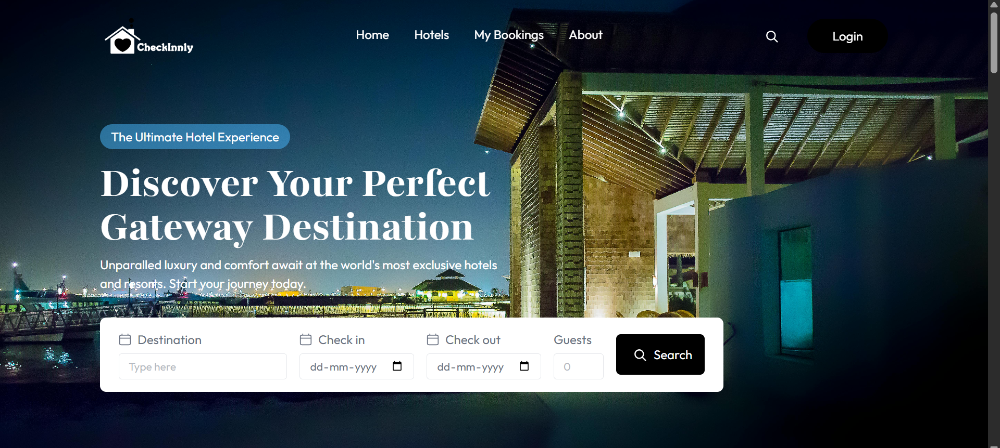
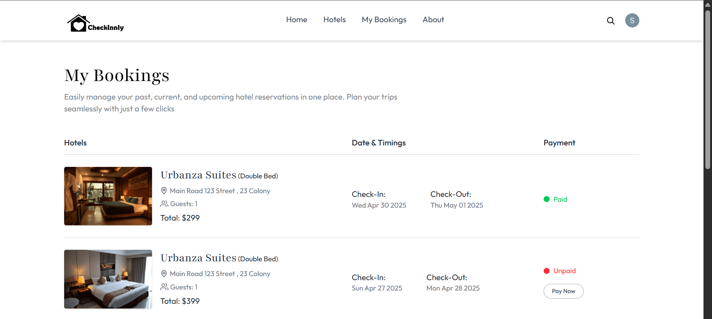
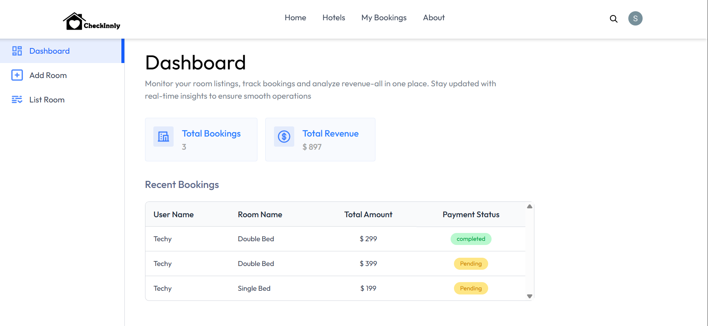

# 🏨 Hotel Booking Web Application

A responsive hotel booking website (front-end only) where users can search for hotels, view details, and make bookings. Built using modern frontend technologies and deployed on Vercel.

🔗 **Live Demo**: [Click here to visit](https://hotel-booking-snowy-nine.vercel.app/)

---

## 📸 Screenshots

| Home Page | Booking Page | Admin Page |
|-----------|--------------|--------------|
|  |  |  |


---

## 🚀 Features

- 🏨 Hotel listing with filtering
- 📄 Detailed view of selected hotels
- 📆 Booking form with calendar input
- 🔍 Search functionality
- ☁️ Hosted live on Vercel

---

## 🛠️ Tech Stack

- **Frontend**: HTML, Tailwind CSS, JavaScript, React.js
- **Deployment**: Vercel

---
## 🚀 Getting Started

### 1. Clone the repository
```bash
git clone https://github.com/Sujith-1608/Hotel-Booking.git
cd Hotel-Booking
```
### 2. Install dependencies
```bash
npm install
```
### 3.  Run the app
```bash
npm start
```
### 4.  Build for production
```bash
npm run build
```
## 📦 Deployment
Deployed on Vercel – push to main branch and it's live 🚀.

## 📬 Contact
Sujith Reddy Sama
📧 ssujithreddi@gmail.com

##
Give it a ⭐ if you liked the project!
##


